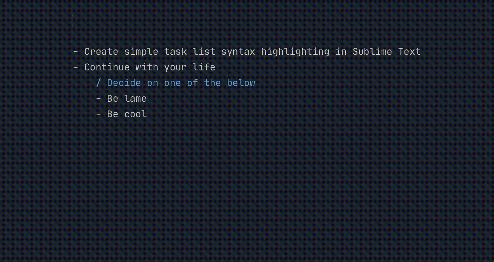

Put some color on the basic task lists that somehow always end up in Sublime.

## Install

Clone this repo into your Sublime Text 3 Packages folder, such as `~/Library/Application Support/Sublime Text 3/Packages`.

Select the now available `Tasks` syntax in Sublime to get started.

## Usage

- Lines starting with `-` are tasks to be done.
- Lines starting with `+` are tasks that are complete.
- Lines starting with `x` are cancelled tasks.
- Lines starting with `/` are notes/questions/other.
- Tab before indicator as much as you want.
